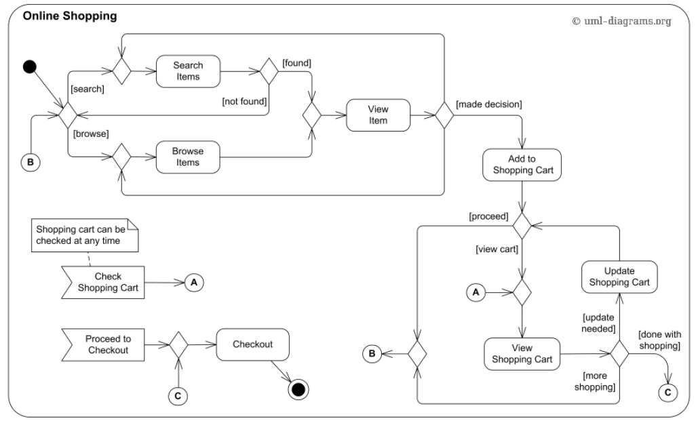

# Testovací scénáře + automatizace

## Zadání

## Zpracování
Jednotlivé testovací případy a jejich kroky jsou popsány v souborech složky [features](features), skripty automatizace potom v [steps](steps). Použila jsem gherkin syntaxi, aby byly srozumitelné pro všechny stakeholdery projektu a zároveň umožnily jednoduchou implementaci automatizace přidáním step definition souborů.

Pre-conditions testu jsou popsány kroky **Given**

Akce testu jsou popsány kroky **When**

Post-conditions testu jsou popsány kroky **Then**

Vzhledem k nízkému počtu případů jsem testovací data uvedla přímo u nich.

Všechny scénáře vycházi z předpokladu, že testovací prostředí je funkční, připraveno k testům a obsahuje produkty zmiňované v jednotlivých případech. Automatizace pak využívá frameworku detox v kombinaci s cucumber.

# Testování webové stránky

## Zadání

Projděte si stránku applifting.io a vytvořte testovací report. Můžete použít jakýkoliv nástroj
kromě testování performance testů (zátěžových testů).

## Zpracování

Níže jsem uvedla okruhy, které by na webu měly být testovány a otázky, na které by takový test měl odpovědět. U tučně zvýrazněných otázek jsem také uvedla postřehy z vlastního testování.

#### Funkční testování
 - Splňuje web zadávací požadavky?
 - Jsou všechny odkazy funkční?
 - Jsou formuláře funkční, poradí si neplatnými vstupy, dojde po odeslání k
   očekávané akci?
 - Splňuje web doporučené specifikace / standardy webových stránek?
#### Responsivita a kompatibilita
 - Jak se web zobrazuje v různých webových prohlížečích?
 - Jak se web zobrazuje na různých operačních systémech?
 - Je web přizpůsoben i zobrazení na mobilním telefonu? 
 - Jak se web zobrazuje na displejích s různými úhlopříčkami?

#### Výkonnostní / zátěžové testování
 - Splňuje web zátěžové požadavky?
 - Jak se web zachová při zpoždění sítě?
 - Poradí si web s výpadky v infrastruktuře nebo s DDoS útokem?
 - Dojde při nárůstu zátěže k prodloužení odezvy webu?
 - **Jak rychle se web načítá / jak rychle jsou načteny klíčové prvky stránky?**

Doba viditelného načtení obsahu stránky (speed index) dosahuje hodnoty 2,2s (na mobilu dokonce 8,1s) což může vést k frustraci uživatele a opuštění stránky. Celkové načtení webu trvalo 26s

Úspory dat lze dosáhnout například odstraněním nevyužitých css stylů a javascriptu.

 - **Jsou použitý kód a vložené obrázky optimalizovány?**

 U obrázků jsou použity formáty .png nebo .jpg - vhodnější by bylo použít WebP. Zároveň jsou načítány obrázky v originální velikosti, i když jsou poté na stránce zobrazeny ve zmenšené verzi. Z tohoto důvodu by zmenšení obrázků vedlo k úspoře přenesených dat a rychlejšímu vykreslení.

 Dále jsou některé obrázky načítány i mimo obrazovku, ačkoliv pro skryté obrázky lze využít tzv. "lazyloading" a načíst je až po načtení kritických zdrojů a dosažení interaktivnosti stránky.

 - Dochází k efektivnímu cachování statických zdrojů?
 - Jsou CSS a JS soubory vhodně minifikovány a sloučeny?
#### Bezpečnostní testování
 - Je web zabezpečen proti nejběžnějším útokům typu XSS nebo CSRF?
 - Jsou správně nastaveny bezpečnostní hlavičky?
 - Jsou externí služby / knihovny využívané webem pravidelně aktualizovány a dostatečně zabezpečeny?
#### Testování použitelnosti / uživatelské přívětivosti
 - Je navigace / hledání na webu jednoduché?
 - Je design přívětivý?
 - Je použitý jazyk srozumitelný?
 - **Je web přizpůsoben i uživatelům se zrakovým postižením?**

 Mnoho tlačítek a odkazů na stránce nemá přístupné názvy, čtečka obrazovky jej tedy ohlásí jako "tlačítko", což jej pro uživatele se zrakovým postižením dělá nepoužitelným. Jelikož se jedná převážně o prvky sloužící k navigaci na stránce, uživateli je v podstatě znemožněno se mezi stránkami pohybovat. Stejný problém způsobí prvky kontaktního formuláře bez správného štítku / labelu.

 Barvy pozadí a popředí nemají dostatečný kontrastní poměr. Text s nízkým kontrastem je pro mnoho uživatelů obtížně čitelný nebo zcela nečitelný.

## Použité nástroje

 - [PageSpeed Insights](https://pagespeed.web.dev/)
 - [Lighthouse](https://github.com/GoogleChrome/lighthouse)
 - [Chrome UX Report](https://developer.chrome.com/docs/crux/)
- [Web Content Accessibility Guidelines (WCAG) 2.1](https://www.w3.org/TR/WCAG21/)
- [A11Y Project](https://www.a11yproject.com/checklist/)
- [UsableNet AQA](https://usablenet.com/automated-accessibility-testing-tool)
